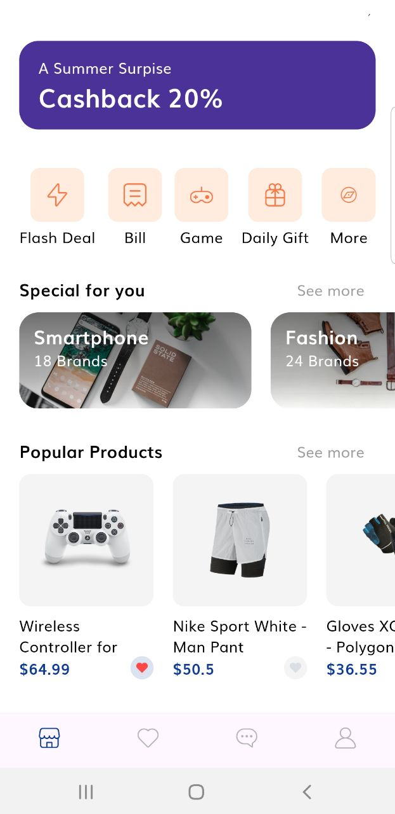

# E-Commerce Flutter

A dynamic ecommerce application to incorporate seamless user experience.

## Features

- **Search**
    - Search products with backend integration

- **Product List**
    - List all products present in the inventory.

- **User Authentication:**
    - Create and manage their profiles.

- **Shopping Cart:**
    - Dynamic cart that contains shopping experience.

- **Payment:**
    - Secure stripe API for payment.

## Technologies Used

- **Flutter:**
- **Firebase:**

